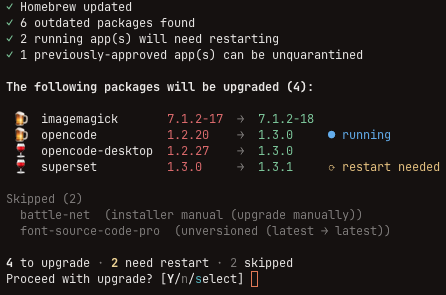

# brew-bouncer

Homebrew upgrade manager for macOS. Updates and upgrades your packages, detects
which running apps were affected, and walks you through restarting them.
Replaces the common post-upgrade reboot with targeted restarts.



## Features

- **Upgrade preview** — shows what will be upgraded with version diffs, which
  apps are running, and which were skipped
- **Interactive selection** — confirm all, pick individual packages, or select
  with a checkbox UI
- **Restart detection** — finds running apps affected by upgrades using
  osascript, `ps`, `pkgutil`, and `brew services`
- **Targeted restarts** — quit and reopen GUI apps, restart brew services, or
  show manual instructions for CLI tools
- **Quarantine management** — preserves macOS quarantine approvals across
  upgrades so you don't re-approve trusted apps
- **Restart policy** — choose upfront: auto-restart all, ask per-app, or skip

## Install

```bash
brew tap jdillon/planet57
brew install brew-bouncer
```

## Usage

```bash
# Show outdated packages and what's running
brew bouncer status

# Upgrade everything with interactive prompts
brew bouncer upgrade

# Upgrade specific packages
brew bouncer upgrade firefox slack

# Skip all confirmations
brew bouncer upgrade --yes
```

## Configuration

Optional config lives at `~/.config/brew-bouncer/config.yaml`.

```yaml
ignore:
  - some-cask

promptDefaults:
  upgrade: yes
  restartPolicy: yes
  quarantinePolicy: yes
```

`promptDefaults` controls the default choice when you press Enter at the main
upgrade prompts:

- `upgrade`: `yes`, `no`, or `select`
- `restartPolicy`: `yes`, `ask`, or `no`
- `quarantinePolicy`: `yes`, `ask`, or `no`

If omitted, the built-in defaults remain `yes` for upgrade confirmation and
`no` for restart/quarantine policy prompts.

## Building from source

Requires [Bun](https://bun.sh).

```bash
bun install
bun run typecheck
bun run build          # native binary at dist/brew-bouncer
bun run dev            # run from source
```

## License

Apache 2.0
